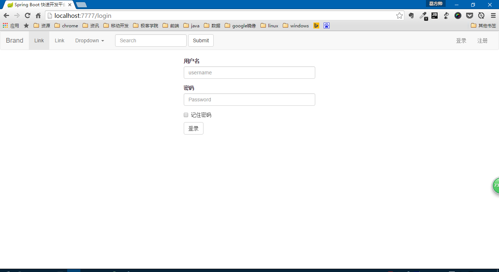
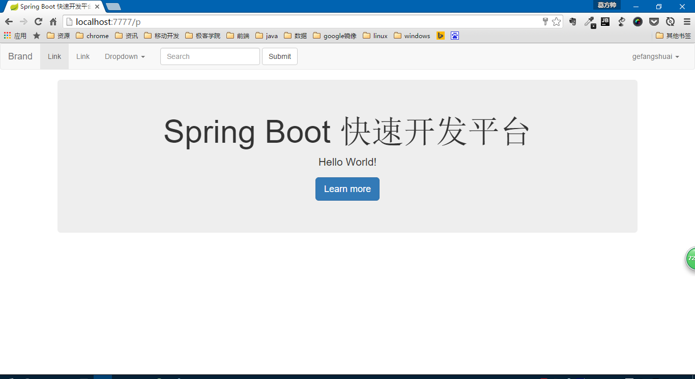

speedy-sample详细介绍
----
一个使用`speedy-ext`开发的用户登录注册示例

# 准备工作

1. 请先安装bower。[Install Bower](http://bower.io/#install-bower)
2. 运行进到`SpeedyFramework/speedy-sample`目录下
3. 运行`bower install` 下载项目用到的静态类库
4. 修改`application.properties`中的各项配置信息，使其符合自己，如“Database Configuration”
5. 运行项目：`mvn spring-boot:run`
6. 访问：[http://localhost:7777](http://localhost:7777)

# 截图
用户登录

用户注册

登陆成功

